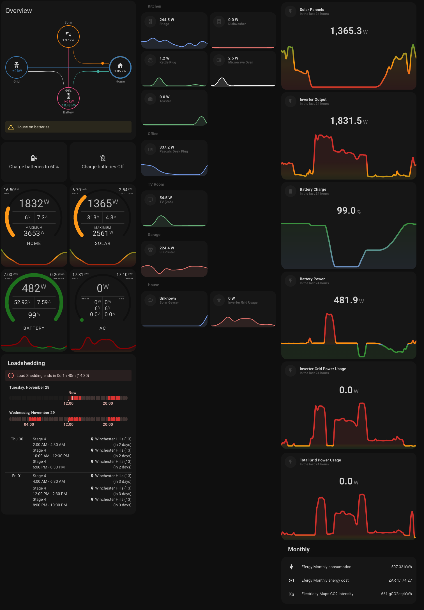
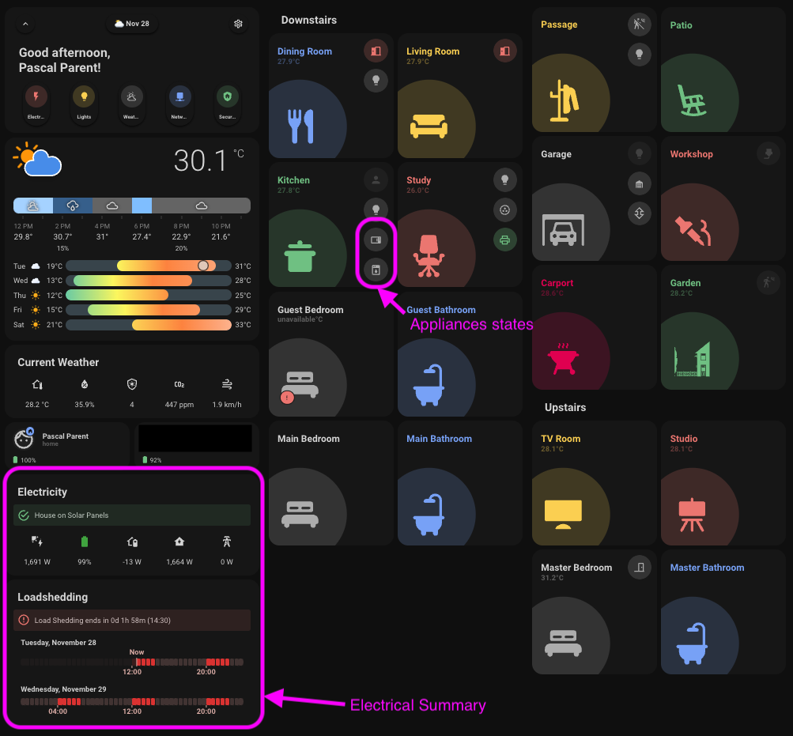

# Home Assistant Electricity Dashboard Page

### Home dashboard Electricity Panel

**Important note:** This page does not replace the Energy dashboard, it compliments it.

## Warning

This example code is supplied "as is" with no warranties of any kind, it works on my setup but it des not mean it will work on yours without modifications or at all. This example is meant to point you in the right direction. I take no responsibilities on it's usage. I've tried to document it sufficiently that it is readable and easy to understand.

**Please note** I've only included the relevant code and files.

This is my implementation of my house's electricity dashboard page, this is a work in progress, expect things to change over time. 

## About

We wanted to be able to monitor house's electricity metrics in real time, to learn how to reduce our electricity consumption. What better way is there than seeing the data in real time?
So after we fitted our inverter, a Sunsynk 8kw Hybrid, we started to strategically install [Shelly 1PM sensors](https://shellysa.co.za/products/relays/shelly-plus-1pm/) around the house, these are under the rooms section of the dashboard (second column).  
It has been of great help, it even showed us some issues in our house which we will attend to over time.
  
*Note: I can't find Shelly 1PM sensors anymore, it's replacement is the Shelly Plus 1PM, the difference as far as I can gather is the chip, the Plus 1PM uses an ESP32 whereas the 1PM used an ESP8266, it also has a higher price tag.*

## Assumptions

- You are willing to get your hands dirty, this means a some yaml code and some HA configurations, but since you are using Home Assistant I guess you knew that already.
- You have a Home Assistant sever that is configured with your inverter of choice.
- You know how to map your Home Assistant server configuration folder via Samba or you can install the Studio Code Server on your HA instance. I use a mapped drive to the Config folder on my server and Studio Code on my machine.

## What you will need

* A running instance of Home Assistant
* An integration into your inverter  
  I use [kellerza's addon for Sunsynk/Dyer](https://github.com/kellerza/sunsynk) on a Raspberry Pi Zero 2 W mounted to a [Raspberry Pi Zero 2W To 3B Adapter](https://www.pishop.co.za/store/raspberry-pi-zero-2w-to-3b-adapter-alternative-solution-for-raspberry-pi-3-model-bb) but a Raspberry Pi 3 or 4 should do just fine.
  (I am working on an ESP32 based alternative)
* Optional: An HA integrated power monitor on your grid, separate to the inverter one, I use an Efergy, I may move to a DIY solution or a Shelly EM.  

## Minimum Dependencies

You will have to install the following dependencies:
* HACS - Home Assistant Community Store  
  Here is a little help from the [Smart Home Junkie](https://youtu.be/Q8Gj0LiklRE)
* The [minimalist theme](https://github.com/UI-Lovelace-Minimalist/UI) from HACS and all it's dependencies.  
Though you could use any other themes, I like the control of code, so the minimalist theme was my best fit. And this example page is entirely dependent on it.
* [Power Flow Card](https://github.com/ulic75/power-flow-card) from HACS
* [Canary](https://github.com/jcwillox/lovelace-canary) from HACS
* [Horseshoe Card](https://github.com/AmoebeLabs/flex-horseshoe-card#-show-section) from HACS
* [Atomic Calendar Revive](https://github.com/totaldebug/atomic-calendar-revive) from HACS
* Optional for my South African friends, [Load shedding](https://github.com/wernerhp/ha.integration.load_shedding) from HACS

## Installation

I have a tree structure that looks like this:

* **Config**  
  Contains all my Home Assistant yaml files
  Of interest to you will be the binary_sensor.yaml, automation.yaml, configuration.yaml, groups.yaml, sensor.yaml, 
  *   **ui_lovelace_minimalist**
    * **dashboard**  
      This is where I hold my master Minimalist Theme configuration file
      ui-lovelace.yaml
      * **Views**  
        This is here I keep my separate views for each entity or room  
        electricity.yaml, home.yaml

If you use the minimalist theme, it should be as easy as copying the code that interest you into the relevant files and adjusting the sensors to your naming convention.

## Any problems?
Though I have attempted to make this as easy and painless as possible, I may have missed something, so feel free to sound off in the Issues section.

## History

- 2023-08-04 First commit.
- 2023-08-30 Updated dashboard to include horseshoe meters, merged some cards and cleaned up some cards.
- 2023-10-12 Updated the Load Shedding panel, added a battery state panel and changed the manual charge buttons which now work with scripts.
- 2023-11-28 
   * Added battery charge state to the Energy page
   * Replaced swartjean ESP integration with Werner Pieterson's.
   * Replace the loadsheding graphical interface with Werner Pieterson's sample code.
   * Various tweaks and fixes

## Sponsoring

 If you like my work and want to support the growth of the project, you can! 

[![Buy Me A Coffee][2]][1]

[1]: https://www.buymeacoffee.com/parentpj
[2]: https://cdn.buymeacoffee.com/buttons/default-black.png