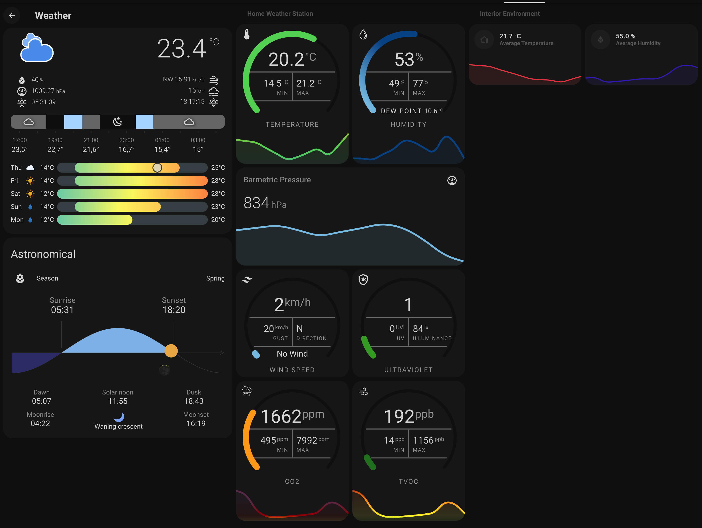
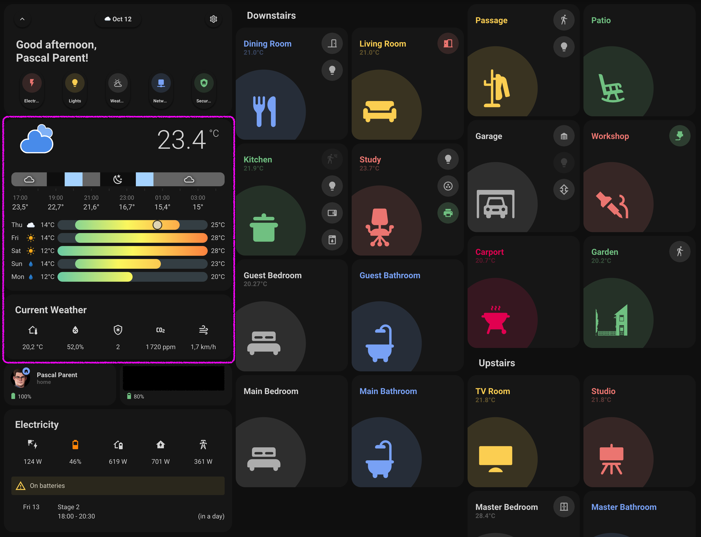

# Home Assistant Weather Dashboard Page

### Home dashboard weather panels

**Important note:** This dashboard makes extensive use of my [DIY weather station](https://github.com/pascal-parent/esphome/tree/main/Weather%20Station) which is still work in progress.

## Warning

This example code is supplied "as is" with no warranties of any kind, it works on my setup but it des not mean it will work on yours without modifications or at all. This example is meant to point you in the right direction. I take no responsibilities on it's usage. I've tried to document it sufficiently that it is readable and easy to understand.

**Please note** I've only included the relevant code and files.

This is my implementation of my house's electricity dashboard page, this is a work in progress, expect things to change over time. 

## About

This is the companion dashboard to my [DIY weather station](https://github.com/pascal-parent/esphome/tree/main/Weather%20Station)
  

## Assumptions

- You are willing to get your hands dirty, this means a some yaml code and some HA configurations, but since you are using Home Assistant I guess you knew that already.
- You have a Home Assistant sever that is configured with your inverter of choice.
- You know how to map your Home Assistant server configuration folder via Samba or you can install the Studio Code Server on your HA instance. I use a mapped drive to the Config folder on my server and Studio Code on my machine.

## What you will need

* A running instance of Home Assistant
* Optionally a weather station like the [one I built](https://github.com/pascal-parent/esphome/tree/main/Weather%20Station) or off-the-shelf.

## Minimum Dependencies

You will have to install the following dependencies:
* HACS - Home Assistant Community Store  
  Here is a little help from the [Smart Home Junkie](https://youtu.be/Q8Gj0LiklRE)
* [Minimalist theme](https://github.com/UI-Lovelace-Minimalist/UI).
* [ApexCharts Card](https://github.com/RomRider/apexcharts-card)
* [button-card](https://github.com/custom-cards/button-card)
* [Canary](https://github.com/jcwillox/lovelace-canary)
* [Clock Weather Card](https://github.com/pkissling/clock-weather-card)
* [Flexible Horseshoe Card](https://github.com/AmoebeLabs/flex-horseshoe-card)
* [Horizon Card](https://github.com/rejuvenate/lovelace-horizon-card)
* [Hourly Weather Card](https://github.com/decompil3d/lovelace-hourly-weather)
* [layout-card](https://github.com/thomasloven/lovelace-layout-card)
* [Lightning Detector Card](https://github.com/ironsheep/lovelace-lightning-detector-card) (WIP)
* [Mini Graph Card](https://github.com/kalkih/mini-graph-card)
* [Animated Weather Card](https://github.com/bramkragten/weather-card)
* [custom maximum and minimum component](https://github.com/philsson/HomeAssistantCustomComponents)

## Installation

I have a tree structure that looks like this:

* **Config**  
  Contains all my Home Assistant yaml files
  Of interest to you will be the binary_sensor.yaml, automation.yaml, configuration.yaml, groups.yaml, sensor.yaml, 
  *   **ui_lovelace_minimalist**
    * **dashboard**  
      This is where I hold my master Minimalist Theme configuration file
      ui-lovelace.yaml
      * **Views**  
        This is here I keep my separate views for each entity or room  
        weather.yaml, home.yaml

If you use the minimalist theme, it should be as easy as copying the code that interest you into the relevant files and adjusting the sensors to your naming convention.

## Any problems?
Though I have attempted to make this as easy and painless as possible, I may have missed something, so feel free to sound off in the Issues section.

## History

- 2023-08-04 First beta commit.
- 2023-08-28 Updated dashboard to include horseshoe meters and cleaned up some cards
- 2023-08-29 Added the sensor definitions
- 2023-10-13 Multiple updates

## Sponsoring

 If you like my work and want to support the growth of the project, you can! 

[![Buy Me A Coffee][2]][1]

[1]: https://www.buymeacoffee.com/parentpj
[2]: https://cdn.buymeacoffee.com/buttons/default-black.png